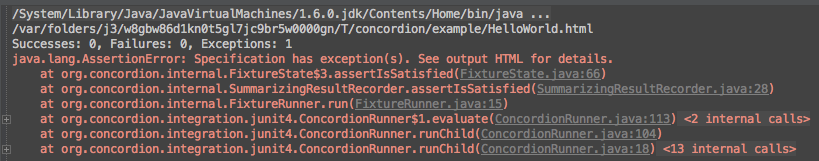

# Concordion Tutorial

The kickstart example from the [Concordion tutorial](http://www.concordion.org/Tutorial.html). 

## The Basics

Concordion은

- 기능을 묘사하는 XHTML 파일
- SUT(System Under Test)의 기능을 검증하기 위해 XHTML 문서의 구체적 example을 찾아서 사용하는 자바로 작성된 fixure 코드

로 구성된다.

이러한 동작이 일어나도록 하기 위해서는 *command*들을 *instrument*해야 한다.

command들은 XHTML 문서의 최상위에 정의된 "concordion" 네임스페이스를 사용한다.

```<html xmlns:concordion="http://www.concordion.org/2007/concordion">```

### concordion:assertEquals

- spces 디렉토리 밑에 example 패키지 생성
- HelloWorld.html 생성
- 아래와 같이 instrument

```
<html xmlns:concordion="http://www.concordion.org/2007/concordion">
<body>
    <p concordion:assertEquals="getGreeting()">Hello World!</p>
</body>
</html>
```

- example 패키지에 HelloWorld[Test|Fixture] 클래스 생성.
	- HelloWorld.html에 대해서는 HelloWorldTest, HelloWorldFixture, HelloWorld 중 하나의 이름으로 fixture를 작성한다.

```
package example;

import org.concordion.integration.junit4.ConcordionRunner;
import org.junit.runner.RunWith;

@RunWith(ConcordionRunner.class)
public class HelloWorldFixture {
}
```

- 이 클래스를 실행해 본다.
- 아래와 같은 오류가 발생한다.



- 결과 파일(```/var/folders/j3/w8gbw86d1kn0t5gl7jc9br5w0000gn/T/concordion/example/HelloWorld.html```)을 브라우저에서 열어보면 아래와 같이 오류의 원인을 알 수 있다.


- 아래와 같이 오류를 해소한다.

```
...
@RunWith(ConcordionRunner.class)
public class HelloWorldFixture {
    public String getGreeting() {
        return "Hello World!";
    }
}
```

- 결과 파일을 리로드하면 아래와 같은 결과를 볼 수 있다.


## concordion:set

```
<html xmlns:concordion="http://www.concordion.org/2007/concordion">
<body>
    <p>
        사용자 Bob에 대한 인사말은: Hello Bob!이다
    </p>
</body>
</html>
```

위와 같은 문장에서 "Bob"은 파라미터로 처리되기를 원한다. 이를 위해서 ```<span>``` 태그와 ```concordion:set```으로 instrument한다.

```
<html xmlns:concordion="http://www.concordion.org/2007/concordion">
<body>
<p>
    사용자 <span concordion:set="#firstName">Bob</span>에 대한 인사말은:
    <span concordion:assertEquals="greetingFor(#firstName)">Hello Bob!</span>이다
</p>
</body>
</html>
```

위와 같이 지정하면 Bob이 #firstName이라는 임시 변수에 저장된다.

이 테스트를 만족시키기 위해서 아래와 같이 메소드를 추가한다.

```
public String greetingFor(String firstName) {
    return String.format("Hello %s!", firstName);
}
```

## concordion:execute

아래와 같은 3가지 용도로 사용된다.

### 1/3. Executing an instruction with a "void" result.

```
<html xmlns:concordion="http://www.concordion.org/2007/concordion">
    <body>
        <p>
            만일 현재 시간이
		    <span concordion:execute="setCurrentTime(#TEXT)">09:00AM</span>이면
		    greeting은
		    <span concordion:assertEquals="getGreeting()">Good Morning World!</span>여야 한다.
        </p>
    </body>
</html>
```

```
package example;

@RunWith(ConcordionRunner.class)
public class HelloWorldFixture {
    private String currentTime;

    public String getGreeting() {
        if("09:00AM".equals(currentTime))
            return "Good Morning World!";
        return "Hello World!";
    }

    public void setCurrentTime(String currentTime) {
        this.currentTime = currentTime;
    }
}
```

아래와 같이 ```#TEXT```를 이용해서 축약할 수 있다.

```
<html xmlns:concordion="http://www.concordion.org/2007/concordion">
    <body>
        <p>
		    만일 현재 시간이
		    <span concordion:execute="setCurrentTime(#TEXT)">09:00AM</span>이면
		    greeting은
		    <span concordion:assertEquals="getGreeting()">Good Morning World!</span>여야 한다.
        </p>
    </body>
</html>
```

### 2/3 Executing an instruction with an object result (to allow multiple properties of the object to be checked).

```
<html xmlns:concordion="http://www.concordion.org/2007/concordion">

    <head>
        <link href="../concordion.css" rel="stylesheet" type="text/css" />
    </head>

    <body>

        <h1>Splitting Names</h1>

        <p>
            메일 보내기 개인화를 위해 고객의 성과 이름이 필요하다. 하지만 고객 데이터는 성과 이름이
		    합쳐진 채로 저장하고 있다.
        </p>

        <p>
            그래서 시스템은 성과 이름으로 합쳐진 이름에서 공백을 이용해서 성과 이름을 분리해야 한다.
        </p>

        <div class="example">

            <h3>예제</h3>

            <p>
                전체 이름
		        <span concordion:execute="#result = split(#TEXT)">John Smith</span>는
        		이름
		        <span concordion:assertEquals="#result.firstName">John</span>과
		        성
		        <span concordion:assertEquals="#result.lastName">Smith</span>.
        		로 분리된다.
            </p>
        </div>
    </body>
</html>
```

```
package example;

import org.concordion.integration.junit4.ConcordionRunner;
import org.junit.runner.RunWith;

import java.util.HashMap;
import java.util.Map;

@RunWith(ConcordionRunner.class)
public class SplittingNamesFixture {
    public Map<String, String> split(String fullName) {
        Map<String, String> result = new HashMap<String, String>();
        result.put("firstName", fullName.split(" ")[0]);
        result.put("lastName", fullName.split(" ")[1]);
        return result;
    }
}
```

### [Handling unusual sentence structures.](http://www.concordion.org/Tutorial.html#executeUnusualSentences)

이 경우는 별로 중요치 않은 듯. 필요하면 링크를 통해 확인하시길...
