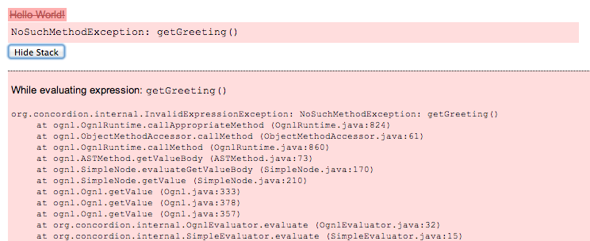

# Concordion Tutorial

The kickstart example from the [Concordion tutorial](http://www.concordion.org/Tutorial.html). 

## The Basics

Concordion은

- 기능을 묘사하는 XHTML 파일
- SUT(System Under Test)의 기능을 검증하기 위해 XHTML 문서의 구체적 example을 찾아서 사용하는 자바로 작성된 fixure 코드

로 구성된다.

이러한 동작이 일어나도록 하기 위해서는 *command*들을 *instrument*해야 한다.

command들은 XHTML 문서의 최상위에 정의된 "concordion" 네임스페이스를 사용한다.

```<html xmlns:concordion="http://www.concordion.org/2007/concordion">```

### concordion:assertEquals

- spces 디렉토리 밑에 example 패키지 생성
- HelloWorld.html 생성
- 아래와 같이 instrument

```
<html xmlns:concordion="http://www.concordion.org/2007/concordion">
<body>
    <p concordion:assertEquals="getGreeting()">Hello World!</p>
</body>
</html>
```

- example 패키지에 HelloWorld[Test|Fixture] 클래스 생성.
	- HelloWorld.html에 대해서는 HelloWorldTest, HelloWorldFixture, HelloWorld 중 하나의 이름으로 fixture를 작성한다.

```
package example;

import org.concordion.integration.junit4.ConcordionRunner;
import org.junit.runner.RunWith;

@RunWith(ConcordionRunner.class)
public class HelloWorldFixture {
}
```

- 이 클래스를 실행해 본다.
- 아래와 같은 오류가 발생한다.


- 결과 파일(```/var/folders/j3/w8gbw86d1kn0t5gl7jc9br5w0000gn/T/concordion/example/HelloWorld.html```)을 브라우저에서 열어보면 아래와 같이 오류의 원인을 알 수 있다.



- 아래와 같이 오류를 해소한다.

```
...
@RunWith(ConcordionRunner.class)
public class HelloWorldFixture {
    public String getGreeting() {
        return "Hello World!";
    }
}
```

- 결과 파일을 리로드하면 아래와 같은 결과를 볼 수 있다.


